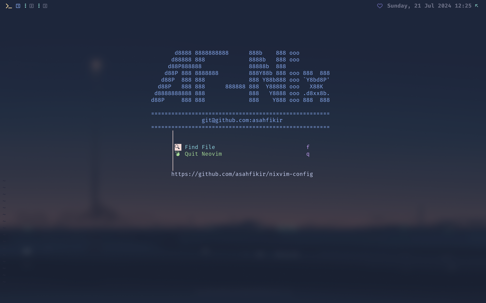
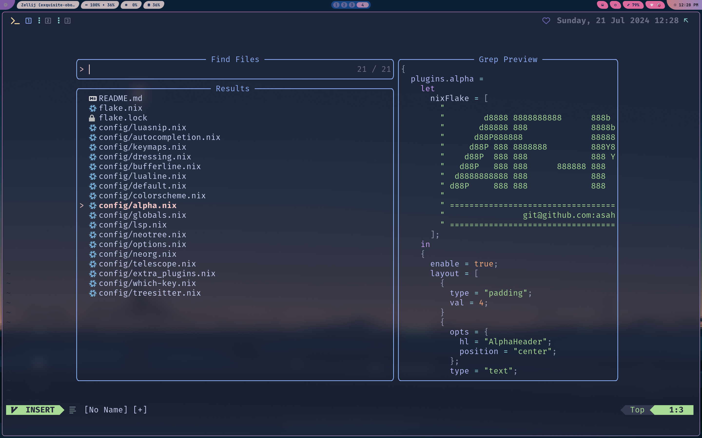
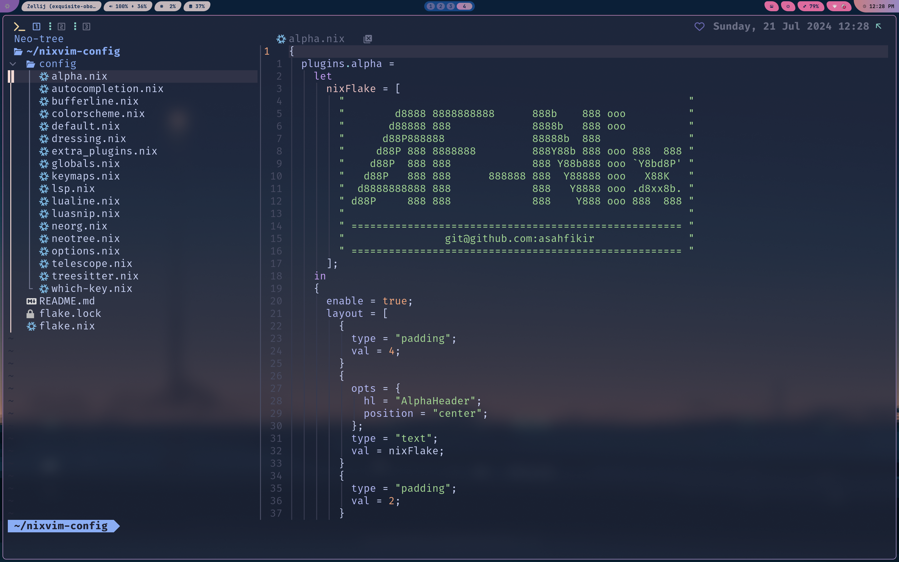
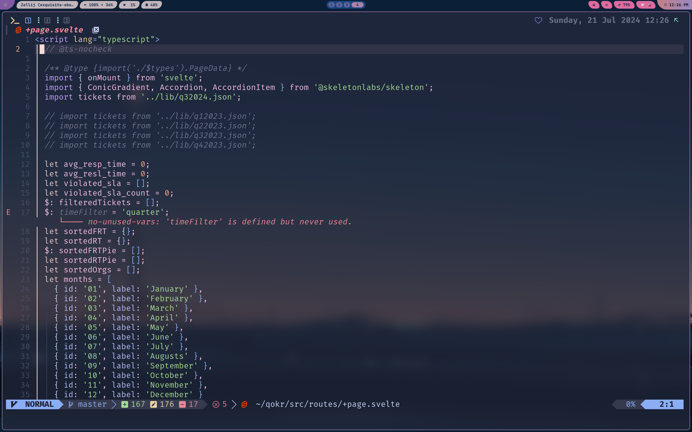
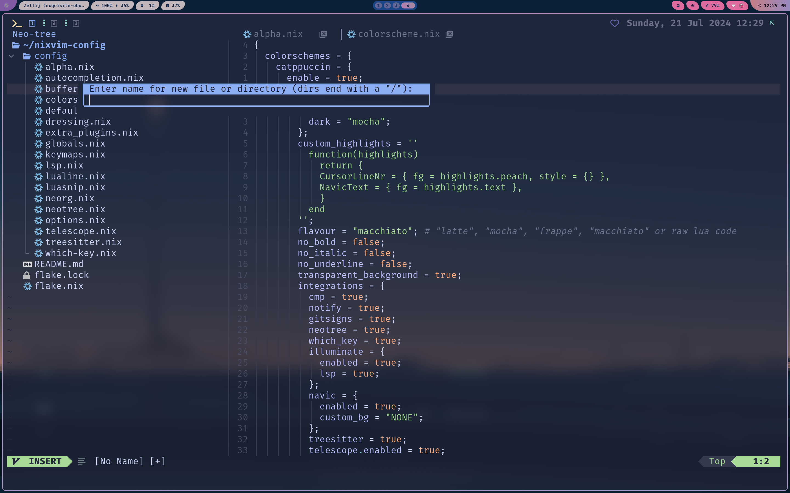

# AF-Nixvim Configuration

This is my personal Nixvim configuration that provides a good starting point for configuring nixvim standalone. I've taken heavy reference from these configurations:
- DC-Tec - https://github.com/dc-tec/nixvim
- Elythh - https://github.com/elythh/nixvim/tree/main
- Niksingh710 - https://github.com/niksingh710/nvix
- Siph - https://github.com/siph/nixvim-flake

## Screenshots






To start configuring, just add or modify the nix files in `./config`.
If you add a new configuration file, remember to add it to the
[`config/default.nix`](./config/default.nix) file

## How to Use This

Clone this repo and simply run the following command

```
nix run .
```
Of course make sure you have at least nix package manager installed on your system.